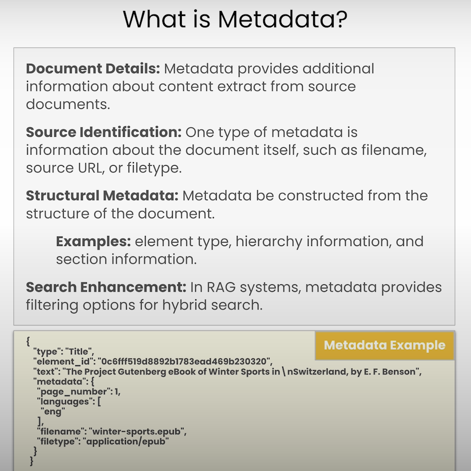
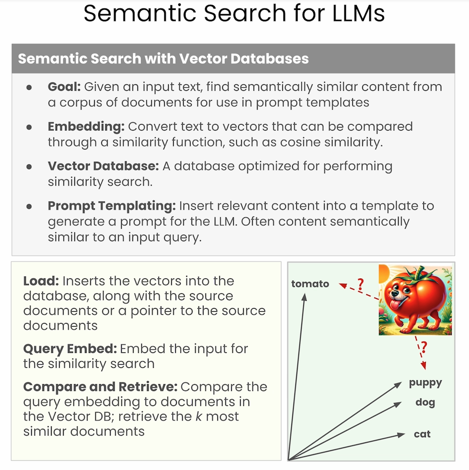
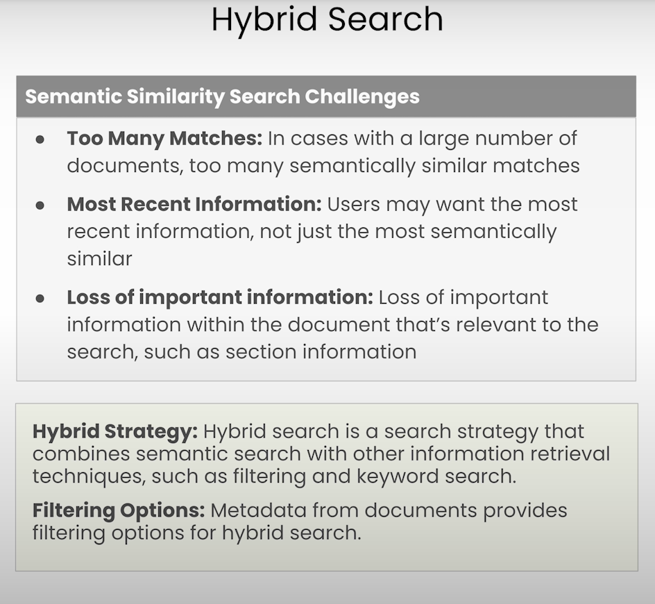
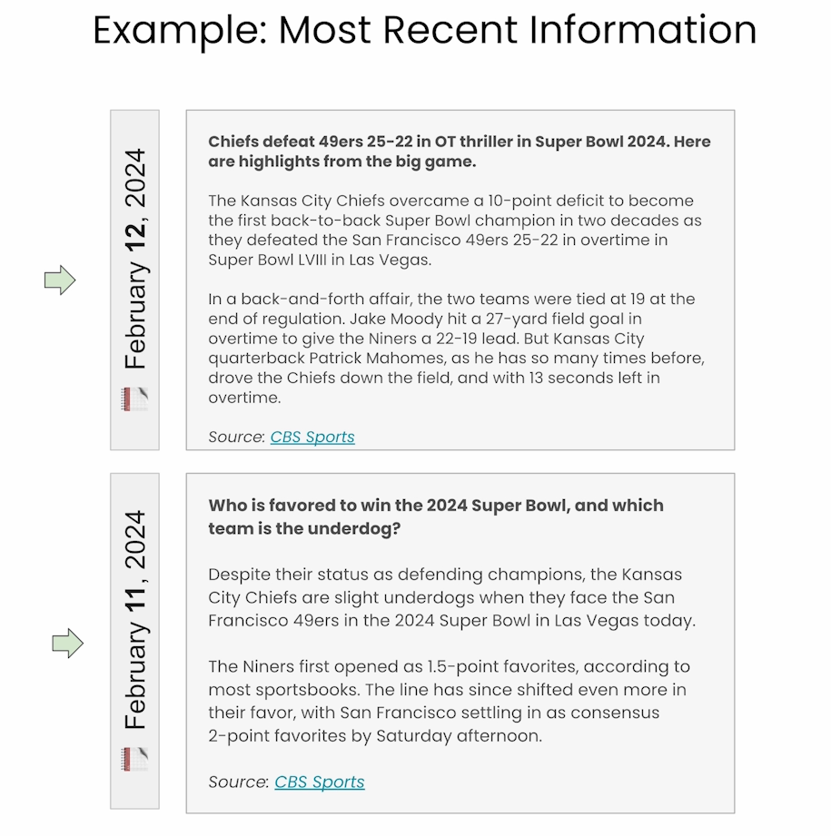
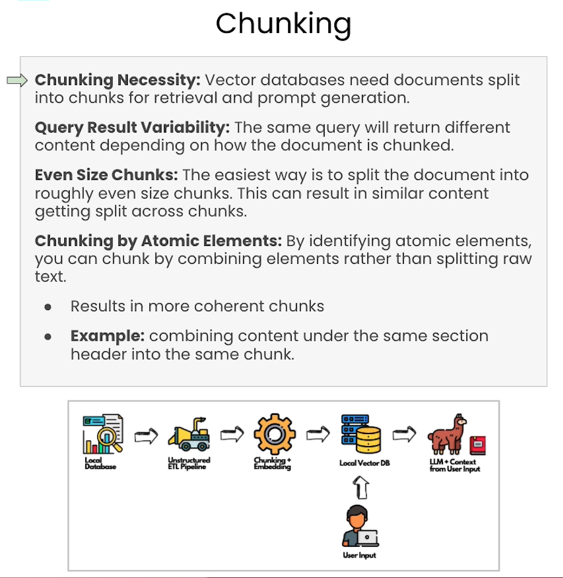
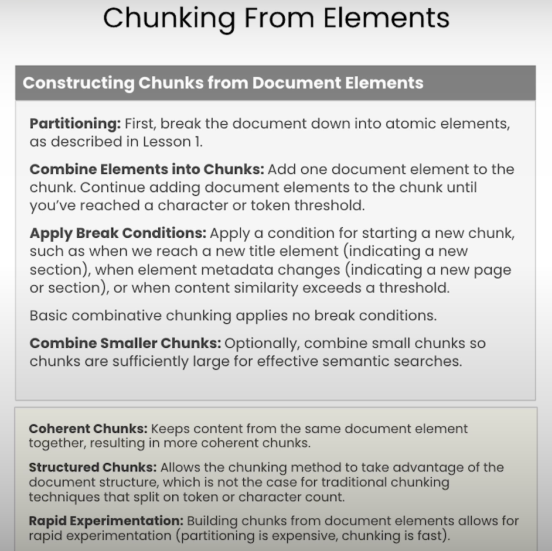
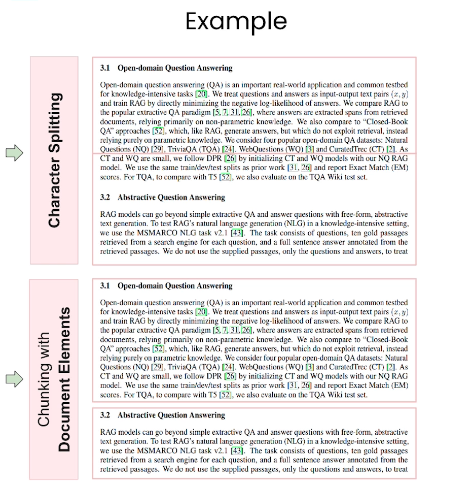

# METADATA EXTRACTION AND CHUNKING

## SEMATIC SEARCH

## HYBRID SEARCH

## MOST RECENT INFORMATION

## CHUNKING

WHY?

- Small context size of LLMs
- Large cost of context size is more. So you can save inference cost.

## CHUNKING FROM ELEMENTS

---
